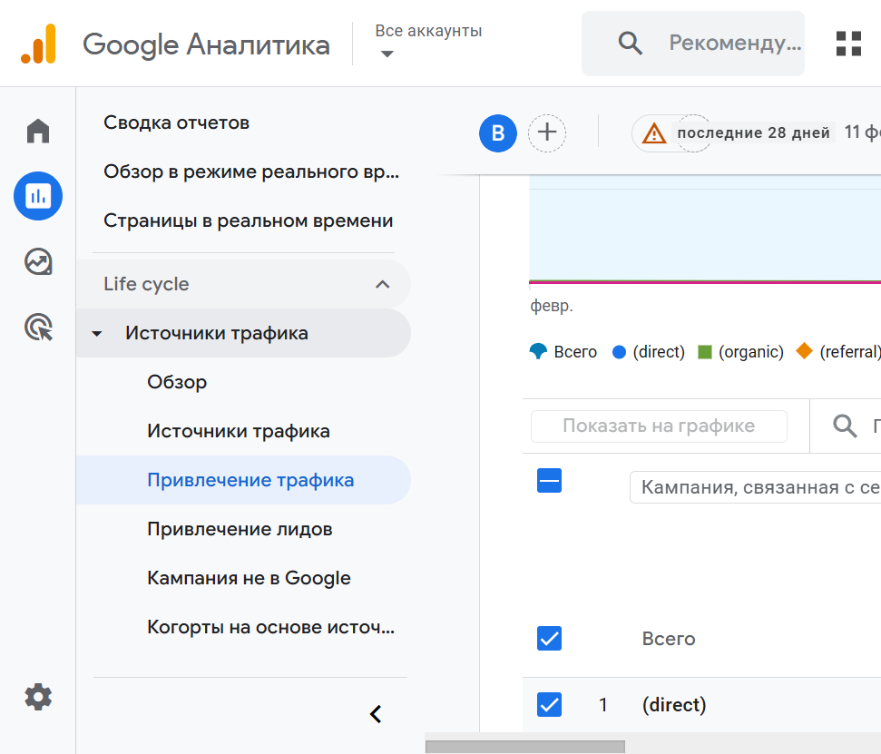
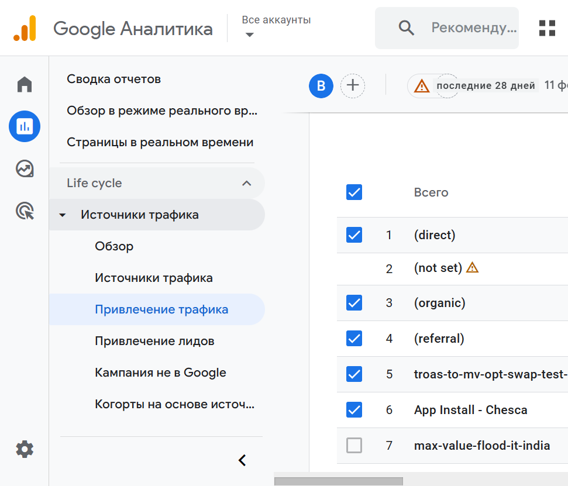

# Анализ рекламной кампании в Google Analytics

**Задание:** Выбрать рекламную кампанию в разделе «Получение трафика», сделать скриншот ключевых показателей (CTR, конверсии) и дать две рекомендации по оптимизации.

---

## 1. Отчёт «Привлечение трафика»

Открыт отчёт **Привлечение трафика: Кампания, связанная с сеансом** (Traffic acquisition by Session campaign) в демо-аккаунте Google Analytics 4.

- Меню: **Отчёты** → **Жизненный цикл** → **Источники трафика** → **Привлечение трафика**.
- В таблице: кампании (direct, organic, referral, troas-to-mv-opt-swap-test-1, App Install - Chesca и др.), метрики — **Сессии**, **Сеансы с взаимодействием**, **Доля взаимодействия**, **Ключевые события**, **Доля сеансов с ключевыми событиями**, **Общий доход**.

CTR в этом отчёте GA4 по умолчанию не выводится (он есть в Google Ads или в отчёте «Реклама» при подключённой рекламе). Конверсии в GA4 отражены через **Ключевые события** и **Долю сеансов с ключевыми событиями**.

---

## 2. Скриншоты ключевых показателей

Новые скриншоты отчёта «Привлечение трафика» (раздел «Получение трафика»): выбран отчёт по кампаниям, таблица с заголовком «Кампания, связанная с сеансом» прокручена в кадр.

**Обзор отчёта и графика по сеансам:**

**Таблица кампаний и выбор метрик:**

**Полная страница отчёта:**

---

## 3. Две рекомендации по оптимизации

**Рекомендация 1.** Улучшить объявления с низким CTR: переписать заголовки и описания под целевую аудиторию, добавить явный призыв к действию (CTA), запустить A/B-тесты вариантов объявлений. Это повысит CTR и при том же бюджете даст больше кликов и потенциально больше конверсий.

**Рекомендация 2.** Перераспределить бюджет в пользу кампаний с лучшим коэффициентом конверсий: снизить расходы на кампании с низкой конверсией и увеличить на те, что дают больше целевых действий (ключевых событий). Так при том же общем бюджете вырастет число конверсий и улучшится окупаемость рекламы.
