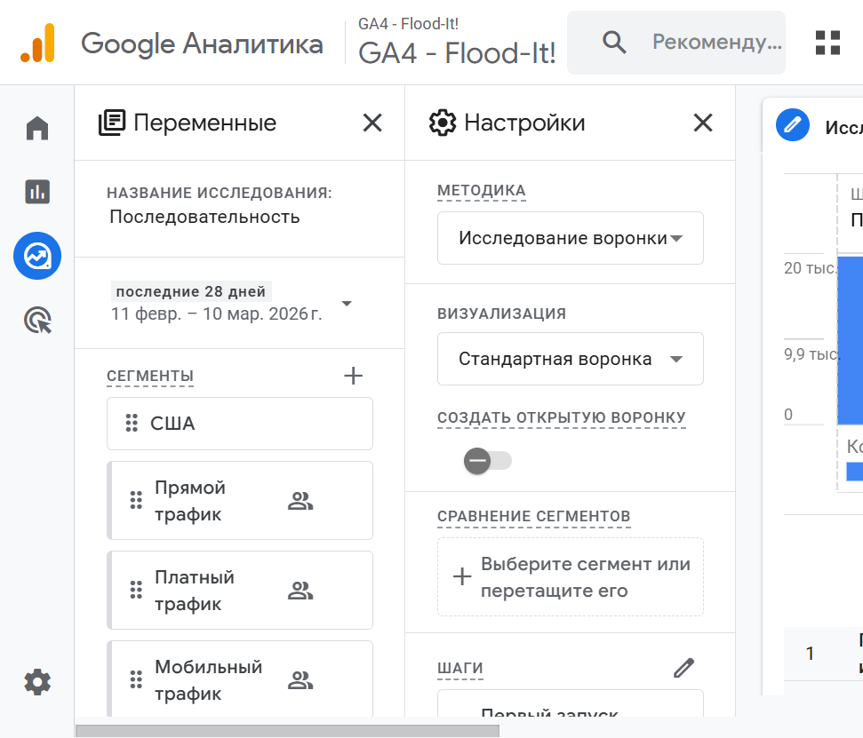

# Анализ воронки конверсий в Google Analytics

**Задание:** В разделе «Конверсии» создать воронку для целевого действия (например, покупка), сделать скриншот и написать 1–2 предложения о стратегии улучшения конверсии на проблемных этапах.

---

## 1. Где создана воронка

В GA4 воронка для целевого действия **покупка** настраивается в разделе **Исследования** (Explore), а не в отдельном отчёте «Конверсии»: выбран шаблон **«Исследование воронки»** (Funnel exploration).

Целевое действие — **Покупка** (purchase). Последовательность шагов воронки:

1. **Первый запуск или посещение** — первый визит пользователя.
2. **Начало сеанса** — старт сеанса.
3. **Просмотр страницы или экрана** — просмотр контента.
4. **Покупка** — целевое конверсионное событие.

По данным демо-ресурса: на первом шаге около 19 385 пользователей, на втором — 18 784 (96,9%), на третьем — 18 549 (95,7%), на четвёртом (Покупка) — только **4 пользователя** (&lt;0,1%). Основная потеря конверсии происходит между этапом «Просмотр страницы» и «Покупка».

---

## 2. Скриншот воронки

---

## 3. Стратегия улучшения конверсии на проблемных этапах

**Проблемный этап:** переход от просмотра страницы/экрана к покупке — до целевого действия доходит менее 0,1% пользователей.

**Рекомендации:** снизить трение на этапе оформления заказа: сократить число полей и шагов, добавить гостевую оплату и сохранение корзины, усилить призывы к действию (очевидные кнопки «Оформить заказ» / «Купить») и элементы доверия (гарантии, отзывы, безопасная оплата). Для пользователей, которые просмотрели товар, но не купили, настроить ремаркетинг и напоминания (email/push) с оффером или упрощённой ссылкой на оформление заказа.
