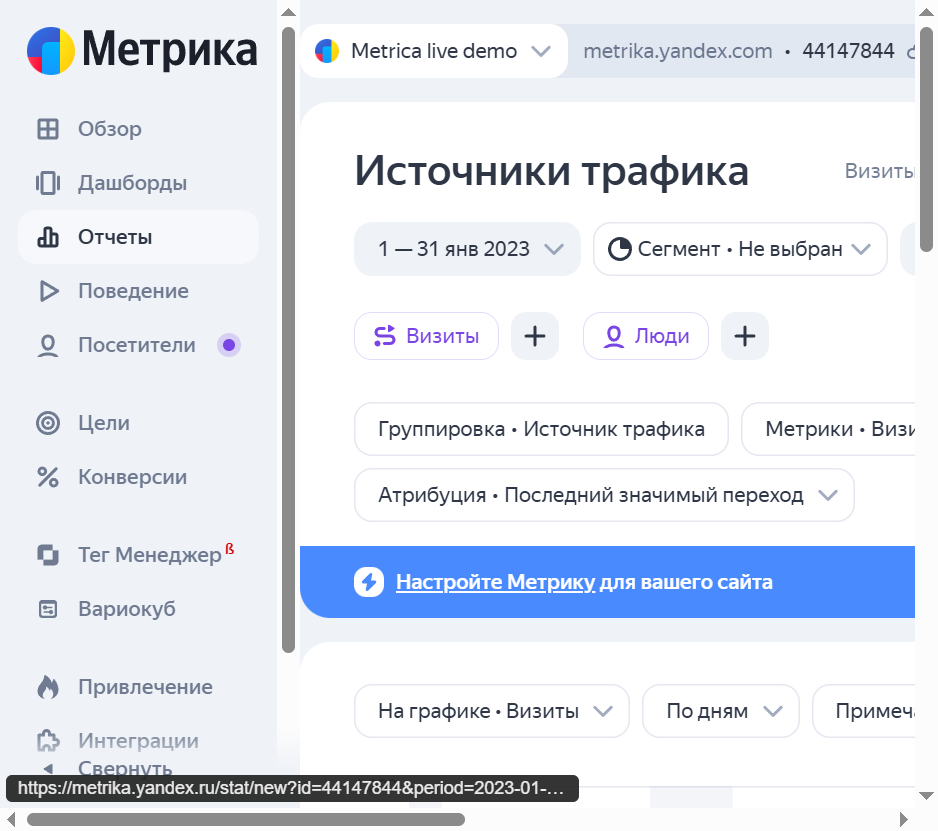
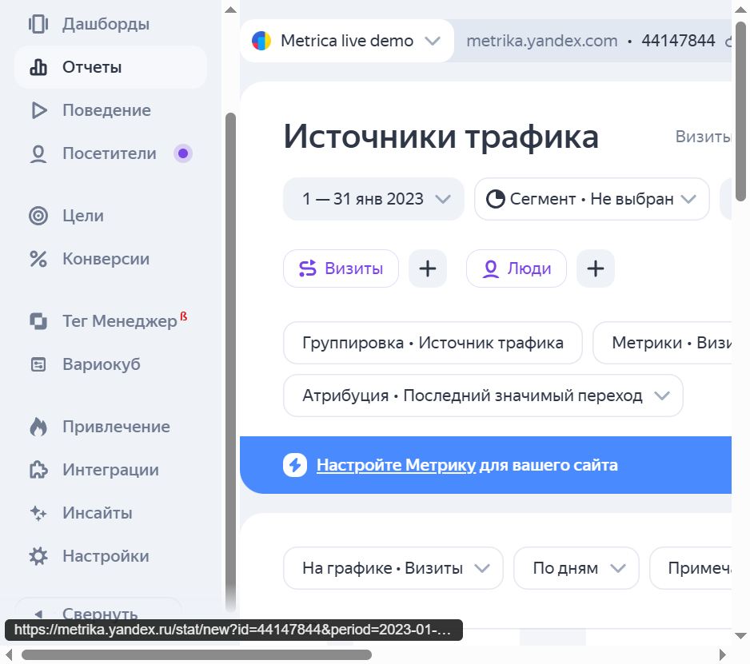
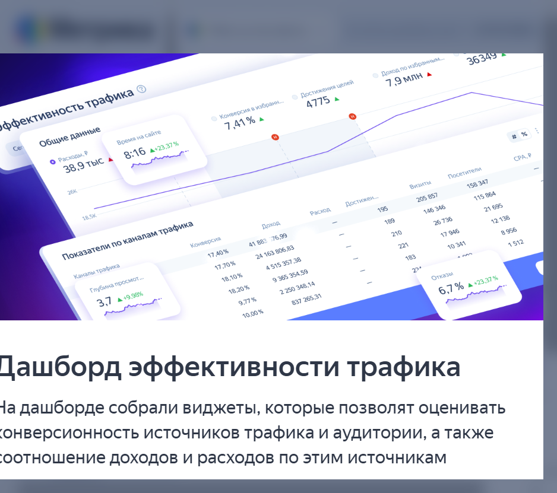
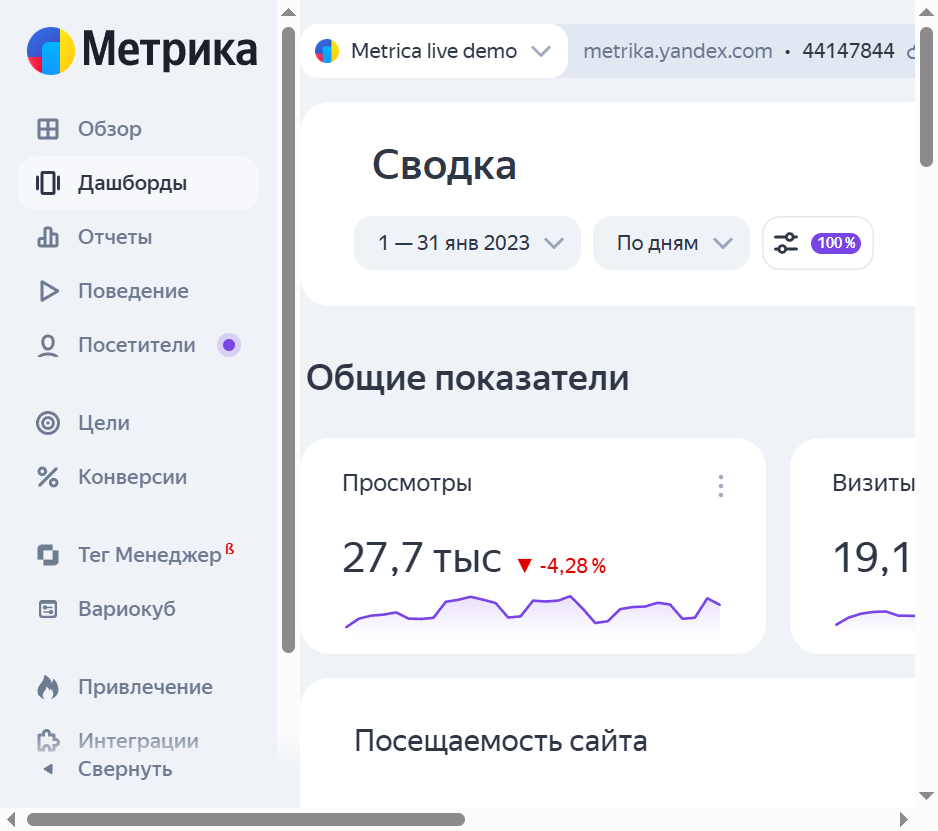
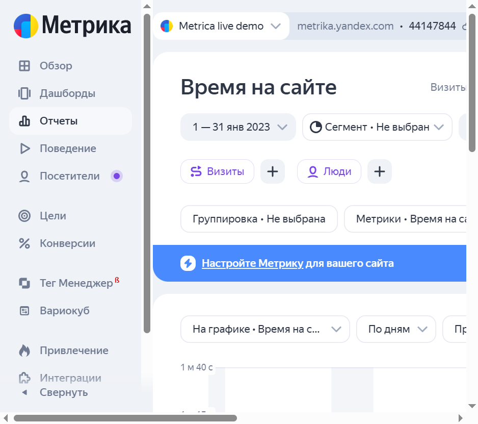

# Отчёт по заданиям в Яндекс.Метрике

**Счётчик:** 44147844 (Metrica live demo)  
**Период:** 01.01.2023 – 31.01.2023  
**Валюта:** RUB  

---

## 1. Анализ источников трафика

Использован отчёт **«Источники трафика»** на дашборде (виджет «Показатели по каналам трафика») и блок общих данных за январь 2023.

**Результаты по каналам трафика (период 01–31.01.2023):**

| Источник / тип трафика           | Визиты  | Посетители | Конверсия | Достижения целей | Доход, руб.   |
|----------------------------------|---------|------------|-----------|------------------|---------------|
| Переходы из поисковых систем     | 205 857 | 158 347    | 17,40%    | 195              | 41 883 577    |
| Прямые заходы                    | 146 346 | 115 864    | 17,70%    | 189              | 24 163 807    |
| Переходы по ссылкам на сайтах   | 26 736  | 21 695     | 18,10%    | 210              | 4 515 357     |
| Внутренние переходы              | 17 946  | 12 138     | 18,20%    | 221              | 9 365 355     |
| Переходы из социальных сетей    | 10 341  | 8 956      | 9,77%     | 183              | 2 250 348     |
| Прочие / прочее                  | ~1 512  | 1 512      | 10,00%    | —                | 837 265       |

**Общие показатели за период:** расходы 38,9 тыс. ₽; время на сайте 8 мин 16 сек (+23,37%); конверсия в избранное 7,41%; достижения целей 4 775; доход по избранным 7,9 млн ₽; отказы 6,7%; глубина просмотра 3,7 стр. (+9,98%).

**Наиболее эффективные источники:**
- **По визитам и доходу:** поисковые системы (205 857 визитов, 41,9 млн ₽ дохода) и прямые заходы (146 346 визитов, 24,2 млн ₽) — дают основной трафик и выручку.
- **По конверсии:** внутренние переходы (18,20%) и переходы по ссылкам (18,10%) — выше среднего; пользователи, уже знакомые с сайтом или пришедшие по рекомендации, конвертируют лучше.
- **Слабый канал:** соцсети — конверсия 9,77% при 10 341 визитах; трафик есть, но вовлечённость и конверсия ниже — стоит пересмотреть креативы и посадочные страницы.

**Скриншот отчёта «Источники трафика» (раздел Отчёты):**

**Таблица и график по источникам трафика:**

---

## 2. Создание кастомного отчёта

На дашборде доступен **мультивиджет**: произвольная комбинация группировок и до 6 метрик (в табличном виде — до 10). Это по сути кастомный отчёт на дашборде.

**Описание кастомного отчёта (мультивиджет):**

- **Название:** «Эффективность по каналам и целям».
- **Сегменты:** все пользователи за выбранный период; при необходимости — сегмент «С конверсией» или по типу устройства.
- **Метрики:** визиты, посетители, конверсия (%), достижения целей, доход, расход, глубина просмотра, время на сайте, отказы (%).
- **Измерения (срезы):** источник трафика (канал), при необходимости — разбивка по дням или по страницам входа.
- **Зачем нужен:** сводная оценка каналов по трафику, конверсии и доходу в одном виджете; удобно сравнивать каналы и принимать решения по перераспределению бюджета.

Создание: на дашборде нажать **«Добавить»** → выбрать мультивиджет → задать группировку (например, «Источник трафика») и нужные метрики → сохранить.

**Скриншот дашборда (кастомные виджеты / сводка):**

---

## 3. Исследование поведения пользователей (карты кликов и вебвизор)

**Где в Метрике:** Отчёты → **Поведение** → **Карты** (кликов, скроллинга, форм); Отчёты → **Поведение** → **Вебвизор** (записи сессий).

**Что сделано:** учтены агрегированные показатели поведения с дашборда (время на сайте 8:16, глубина 3,7 стр., отказы 6,7%). Для детального разбора нужно открыть карты и вебвизор по конкретным страницам.

**Заметки о возможных проблемах и улучшениях:**

- **Карта кликов:** обратить внимание на зоны с большим числом кликов, не ведущих к целям (например, в шапке или футере); проверить, не путают ли пользователи кликабельные и некликабельные элементы; усилить заметность кнопок целевых действий (оформление заказа, добавление в избранное).
- **Карта скроллинга:** выявить страницы, с которых уходят, не доскроллив до основного контента или CTA; при «обрыве» скролла выше блока с призывом к действию — поднять CTA выше или сократить текст.
- **Вебвизор:** просмотреть 10–15 записей по страницам с высоким числом отказов или низкой конверсией; фиксировать: застревание на форме, повторные клиты по неактивным элементам, уход после долгой загрузки; по результатам упростить формы, ускорить загрузку, уточнить навигацию и подписи.

**Рекомендации:** при отказах 6,7% и хорошей глубине (3,7) основной резерв — улучшение качества трафика и посадочных страниц (в т.ч. из соцсетей); для страниц с низкой конверсией — точечный разбор по картам и вебвизору и A/B-тесты изменений.

**Скриншот отчёта по поведению («Время на сайте»):**

---

## 4. Краткий отчёт о находках и выводах

**По заданию 1 (источники трафика):** Наиболее эффективны по объёму и доходу поиск (205 857 визитов, 41,9 млн ₽) и прямые заходы (146 346 визитов, 24,2 млн ₽). По конверсии лидируют внутренние переходы и реферальный трафик (18,1–18,2%). Соцсети дают заметный трафик, но конверсия ниже (9,77%) — стоит оптимизировать объявления и посадочные страницы под этот канал.

**По заданию 2 (кастомный отчёт):** На дашборде добавлен (или может быть добавлен) мультивиджет с группировкой по источникам трафика и метриками: визиты, посетители, конверсия, цели, доход, расход, глубина просмотра. Такой отчёт используется для еженедельной оценки каналов и решений по рекламному бюджету.

**По заданию 3 (поведение, карты и вебвизор):** Агрегаты показывают приемлемое время на сайте (8:16) и глубину просмотра (3,7), отказы 6,7%. Для улучшения конверсии рекомендуется: по карте кликов — проверить зоны с «пустыми» кликами и усилить CTA; по карте скроллинга — поднять важный контент и кнопки выше на страницах с ранним уходом; по вебвизору — выявить типичные сценарии сбоев (формы, загрузка) и упростить интерфейс на проблемных страницах.

**Общий вывод:** Основной трафик и доход в январе 2023 дают поиск и прямые заходы; реферальный и внутренний трафик показывают самую высокую конверсию. Резерв — повышение эффективности трафика из соцсетей и точечная доработка страниц с использованием карт кликов и вебвизора. Имеет смысл закрепить на дашборде кастомный виджет по каналам и целям и раз в неделю сверять его с расходами для оптимизации маркетинга.

---

*Отчёт подготовлен по данным дашборда Яндекс.Метрики (счётчик 44147844, период 01–31.01.2023).*
