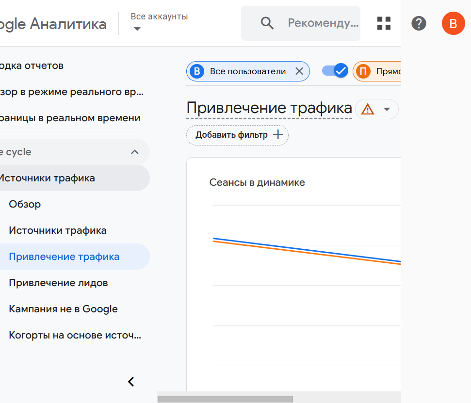

# Сегментация пользователей в Google Analytics

**Задание:** Создать сегмент пользователей по возрасту или источнику трафика, сделать скриншот анализа и ввести 1–2 предложения о различиях в поведении сегмента.

---

## 1. Созданный сегмент

В отчёте **«Привлечение трафика»** (Отчёты → Жизненный цикл → Источники трафика) добавлено сравнение по **источнику трафика**:

- Нажата кнопка **«Добавить сравнение»**.
- Выбран встроенный сегмент **«Прямой трафик»** (Direct) — сеансы, полученные напрямую (переход по закладке, ввод URL, без перехода с других сайтов).
- Сравнение применено вместе с базовым сегментом **«Все пользователи»**.

На скриншоте видно два активных сегмента («Все пользователи» и «Прямой трафик») и график **«Сеансы в динамике»** с двумя линиями — по одному ряду для каждого сегмента.

---

## 2. Скриншот анализа

---

## 3. Различия в поведении сегмента

Пользователи **прямого трафика** в демо-данных GA4 дают более высокую долю сеансов с взаимодействием (~94% против ~87% в среднем по всем пользователям), больше среднее время взаимодействия на сеанс (около 4 минут против ~3 мин 16 сек в целом) и выше долю сеансов с ключевыми событиями (~98,6%). То есть прямой трафик ведёт себя как более вовлечённая и целевая аудитория: дольше остаётся на сайте и чаще совершает целевые действия по сравнению с усреднённым пользователем.
