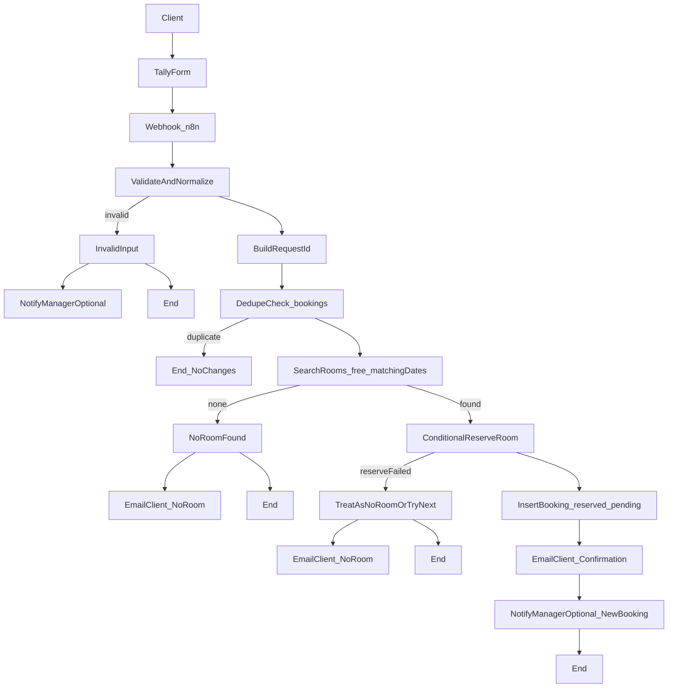
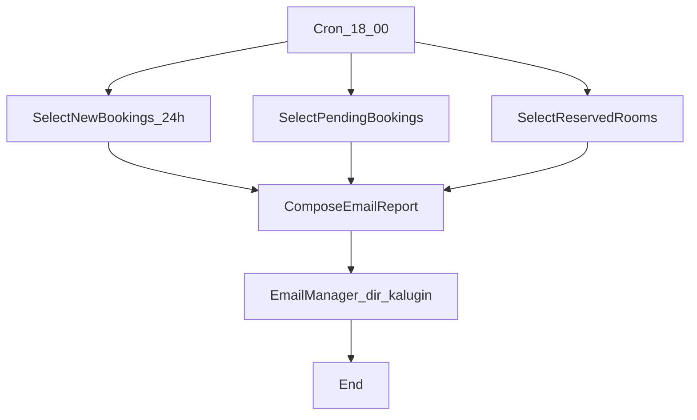

# Схема процесса (Mermaid)

Ниже две схемы: обработка заявки (Webhook) и ежедневный отчёт (Cron 18:00).  
Можно вставить в любой markdown-редактор, поддерживающий Mermaid, или использовать как основу для схемы в draw.io/ProcessOn.

---

## A) Обработка заявки (Tally → Webhook → Supabase → Gmail)

---

## B) Ежедневный отчёт (Cron 18:00 → Supabase → Gmail)

---

## Как быстро перенести в сервис схем
- **draw.io**: вставьте как референс и соберите блоки вручную (обычно 5–10 минут).
- **ProcessOn**: аналогично; используйте 2 дорожки (заявка и ежедневный отчёт).

